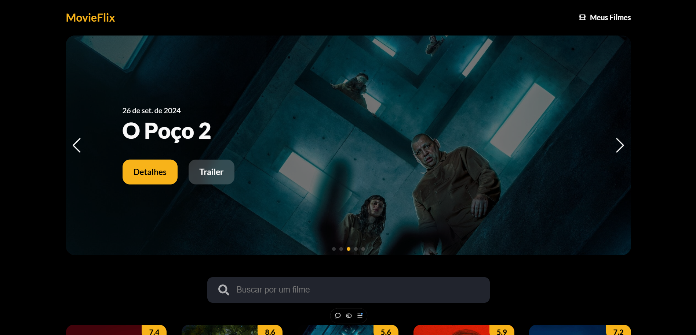

# Movieflix


**[Ver projeto](https://movieflix-sandy-five.vercel.app/)**

**Este projeto é uma adaptação de um projeto do treinamento FullStack.**

### Recursos adicionandos ao projeto:

- Responsividade;
- Paginação infinita;
- Layout remodelado;
- Swiper para criação de um slide de imagens;
- Componente de busca para pesquisa de filmes;
- Biblioteca de icones react-icons (Font Awesome);
- Informações extras disponibilizadas na API do The Movie DB;
-  Lazy loading para otimização de carregamento das imagens;

## Recursos utilizados

- **[Axios](https://www.npmjs.com/package/axios)**
- **[React](https://pt-br.legacy.reactjs.org/)**
- **[Swiper](https://swiperjs.com/)**
- **[React Dom](https://www.npmjs.com/package/react-dom)**
- **[React Icons](https://www.npmjs.com/package/react-icons)**
- **[API The Movie Database](https://developer.themoviedb.org/docs/getting-started)**
- **[React Lazy Load Image Component](https://www.npmjs.com/package/react-lazy-load-image-component)**

## Executando a aplicação no ambiente local
Caso você deseja executar o projeto na sua máquina local, basta seguir os passos abaixo:

Para começar, você deve simplesmente clonar o repositório do projeto na sua máquina e instalar as dependências.

Abra o cmd (caso esteja utilizando o Windows) navegue até o local onde você clonou o projeto

``` 
cd "C:\Users\NomeDoComputador\Documents\cloneprojeto"
```

Depois, quando estiver na pasta do projeto, basta digitar no cmd a seguinte instrução: (dentro da pasta do projeto clonado)

```
npm install
```

- `node_modules` - que contêm os packages do npm que precisará para o projeto.

### Executando a aplicação 

No diretório do projeto execute o camando abaixo para executar o projeto:

```
npm start
```

## Tenho dúvidas... O que fazer? 

Caso tenham dúvidas sobre o código do projeto, sintam-se a vontade em abrir uma [ISSUE AQUI](https://github.com/danielsouzaaj/movieflix/issues). Assim que possível, estarei respondendo as todas as dúvidas que tiverem!

## Licença

* Licenciado sob a licença MIT - veja [LICENSE](https://github.com/danielsouzaaj/movieflix/blob/main/LICENSE) para mais informações.

----------------------

##### Desenvolvido por Daniel Souza.